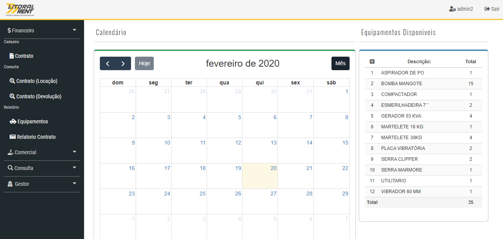
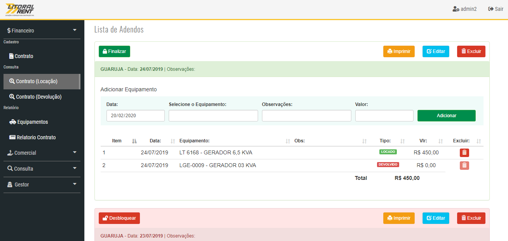
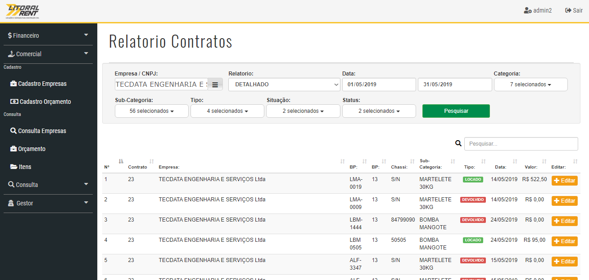

# Financeiro Atlasware 
> Projeto de um sistema de controle de entrada e saida de equipamentos, realizado para uma empresa de locação de equipamento

Sistema foi desenvolvido com intuito de suprir as necessidades de uma locadora de equipamentos, o planejamento era adicionar controle e gestão de entrada e saida de locação e devolução de equipamentos, emissao de orçamentos e relatorios de medição, foi desenvolvido dois modulos separados um para controle financeiro e outro para controle de equipamentos, no futuro a ideia era juntar os dois.

Foi descontinuado, já que a empresa interessada no projeto não deu continuidade no pagamento dele.

## Envolvido no desenvolvimento

Jorge Henrique – [@LinkedIn](https://www.linkedin.com/in/jorge-henrique-baptista/) – jorgehenrique@live.com

The MIT License (MIT)

Copyright (c) 2019 atlasware
